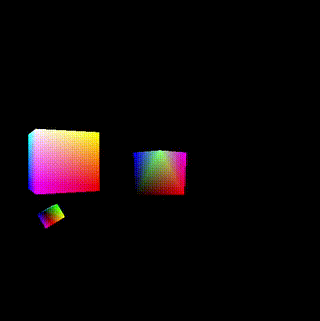
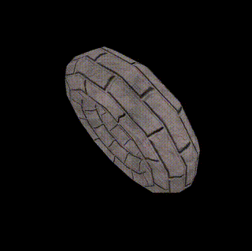

```powershell
Get-Command vcpkg | Select-Object -ExpandProperty Source
vcpkg install
```

---

Chapter 4

 \
[src](./chapter-04/program-01)

 \
[src](./chapter-04/program-02)

 \
[src](./chapter-04/program-05)

---

Chapter 5

 \
[src](./chapter-05/program-01)

---

Chapter 6

 \
[src](./chapter-06/program-01)

 \
[src](./chapter-06/program-02)

---


<!--  foreach($i in 1..13 ){mkdir "program-${i}"} -->