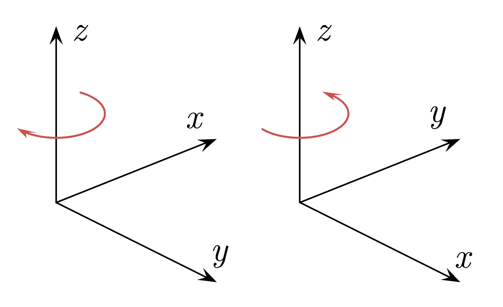
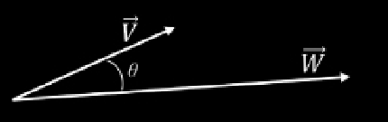
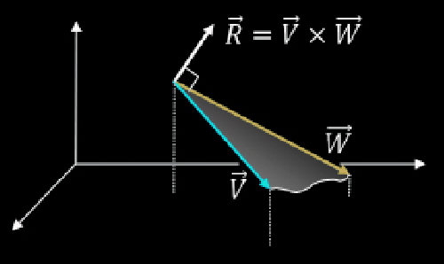
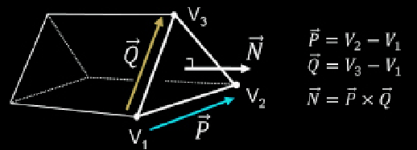
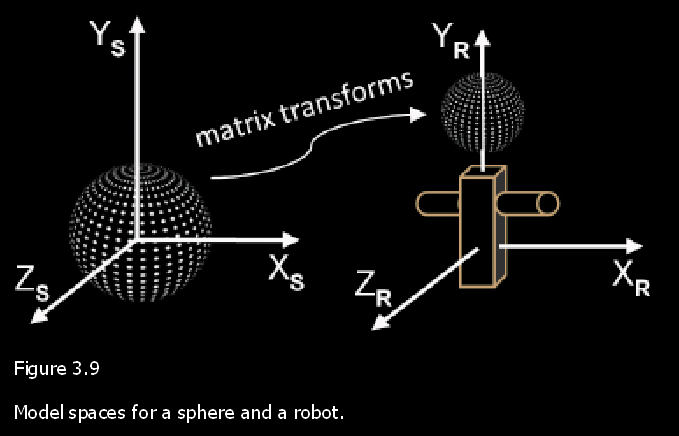
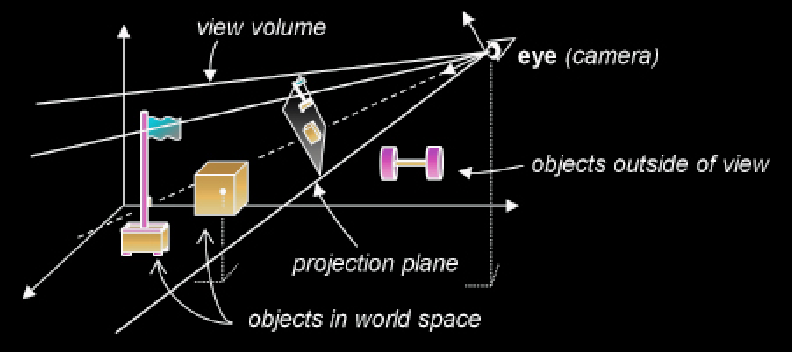
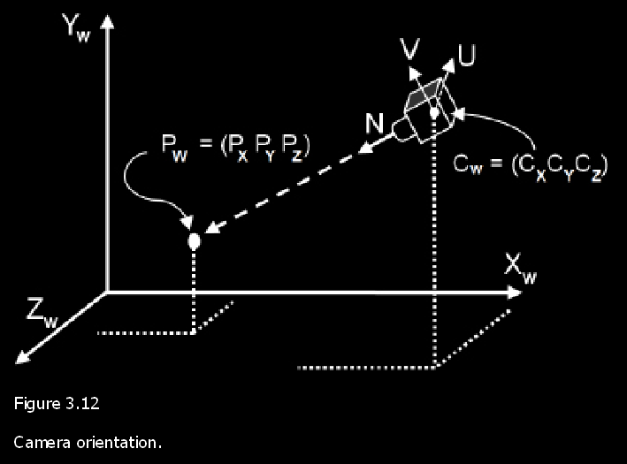
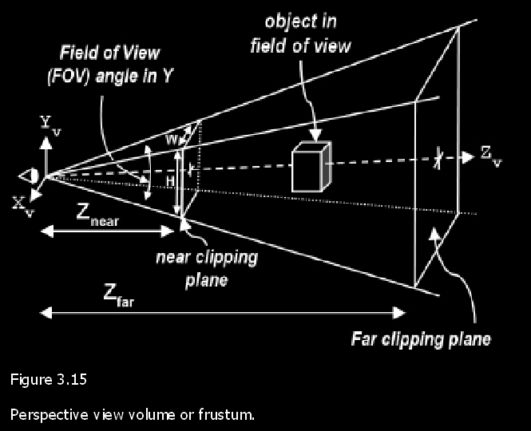
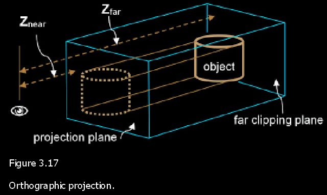
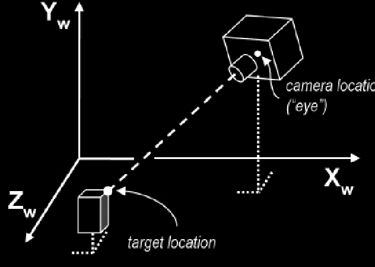

## 3.1 3D Coordinate systems 



> The left-handed orientation is shown on the left, and the right-handed on the right.

## 3.2 Points

#### Links:

1. [Homogeneous coordinates](https://en.wikipedia.org/wiki/Homogeneous_coordinates)
2. [GLSL](https://en.wikipedia.org/wiki/OpenGL_Shading_Language)
3. [GLM (OpenGL Mathematics)](https://github.com/g-truc/glm)

#### Formulas:

For a 3D point $(x, y, z)$ in homogeneous coordinates:

$$
  \begin{pmatrix} x \\ y \\ z \\ 1 \end{pmatrix}
$$

Conversion from homogeneous to Cartesian coordinates:

$$
  (x', y', z') = \left( \frac{x}{w}, \frac{y}{w}, \frac{z}{w} \right)
$$

#### Explanation:

> "Homogeneous" means "same type" or "consistent." In math, \
> "homogeneous coordinates" are a way of writing points \
> with an extra number to make calculations easier, \
> especially for things like 3D transformations.

In homogeneous coordinates, a 3D point `(x, y, z)` is represented as `(x, y, z, w)`, \
where `w` is a fourth coordinate, typically set to `1` for standard points. 

The values `(x, y, z)` represent the spatial position, \
while `w` allows transformations like translation and perspective projection. \
When `w = 1`, the point `(x, y, z, 1)` corresponds directly to `(x, y, z)` in Cartesian coordinates. 

For any homogeneous point `(x, y, z, w)`, \
to convert back to Cartesian, we divide by `w`:

$(x', y', z') = \left( \frac{x}{w}, \frac{y}{w}, \frac{z}{w} \right)$


## 3.3 Matrices 

##### Example of 4x4 matrix:

```math
\begin{bmatrix}
A_{00} & A_{01} & A_{02} & A_{03} \\
A_{10} & A_{11} & A_{12} & A_{13} \\
A_{20} & A_{21} & A_{22} & A_{23}  \\
A_{30} & A_{31} & A_{32} & A_{33}  \\
\end{bmatrix}
```

```cpp
glm::mat4 A(
    glm::vec4(A00, A01, A02, A03),
    glm::vec4(A10, A11, A12, A13),
    glm::vec4(A20, A21, A22, A23),
    glm::vec4(A30, A31, A32, A33)
);
```

---

Identity matrix

```math
\begin{bmatrix}
1 & 0 & 0 & 0 \\
0 & 1 & 0 & 0 \\
0 & 0 & 1 & 0 \\
0 & 0 & 0 & 1 
\end{bmatrix}
```

```cpp
 glm::mat4 identityMatrix = glm::mat4(1.0f); // a 4×4 floating-point matrix
```

---

##### Transpose of a matrix

The GLM library and GLSL both have transpose functions: \
`glm::transpose(mat4)` and `transpose(mat4)` respectively. 

```math
\begin{bmatrix}
A_{00} & A_{01} & A_{02} & A_{03} \\
A_{10} & A_{11} & A_{12} & A_{13} \\
A_{20} & A_{21} & A_{22} & A_{23} \\
A_{30} & A_{31} & A_{32} & A_{33} \\
\end{bmatrix}
=
\begin{bmatrix}
A_{00} & A_{10} & A_{20} & A_{30} \\
A_{01} & A_{11} & A_{21} & A_{31} \\
A_{02} & A_{12} & A_{22} & A_{32} \\
A_{03} & A_{13} & A_{23} & A_{33} \\
\end{bmatrix}^T
```


```cpp
glm::mat4 A(
    glm::vec4(A00, A01, A02, A03),
    glm::vec4(A10, A11, A12, A13),
    glm::vec4(A20, A21, A22, A23),
    glm::vec4(A30, A31, A32, A33)
);
glm::mat4 A_transposed = glm::transpose(A);
```

---

##### Matrix addition

```math
\begin{bmatrix}
A+a & B+b & C+c & D+d \\
E+e & F+f & G+g & H+h \\
I+i & J+j & K+k & L+l \\
M+m & N+n & O+o & P+p
\end{bmatrix}
=
\begin{bmatrix}
A & B & C & D \\
E & F & G & H \\
I & J & K & L \\
M & N & O & P
\end{bmatrix}
+
\begin{bmatrix}
a & b & c & d \\
e & f & g & h \\
i & j & k & l \\
m & n & o & p
\end{bmatrix}
```

In GLSL the `+` operator is overloaded on `mat4` to support matrix addition. 

```cpp
glm::mat4 A(
    glm::vec4(A, B, C, D),
    glm::vec4(E, F, G, H),
    glm::vec4(I, J, K, L),
    glm::vec4(M, N, O, P)
);
glm::mat4 B(
    glm::vec4(a, b, c, d),
    glm::vec4(e, f, g, h),
    glm::vec4(i, j, k, l),
    glm::vec4(m, n, o, p)
);
glm::mat4 result = A + B;
```

---

##### Multiplying point by a matrix 

```math
\left( \begin{matrix}
AX & BY & CZ & D \\
EX & FY & GZ & H \\
IX & JY & KZ & L \\
MX & NY & OZ & P
\end{matrix} \right)
=
\begin{bmatrix}
A & B & C & D \\
E & F & G & H \\
I & J & K & L \\
M & N & O & P
\end{bmatrix}
*
\left( \begin{matrix}
X \\
Y \\
Z \\
1
\end{matrix} \right)
```

---

Multiplying a 4x4 Matrix by another 4x4 matrix

```math
\begin{bmatrix}
A & B & C & D \\
E & F & G & H \\
I & J & K & L \\
M & N & O & P
\end{bmatrix}
*
\begin{bmatrix}
a & b & c & d \\
e & f & g & h \\
i & j & k & l \\
m & n & o & p
\end{bmatrix}
=
\begin{bmatrix}
Aa + Be + Ci + Dm & Ab + Bf + Cj + Dn & Ac + Bg + Ck + Do & Ad + Bh + Cl + Dp \\
Ea + Fe + Gi + Hm & Eb + Ff + Gj + Hn & Ec + Fg + Gk + Ho & Ed + Fh + Gl + Hp \\
Ia + Je + Ki + Lm & Ib + Jf + Kj + Ln & Ic + Jg + Kk + Lo & Id + Jh + Kl + Lp \\
Ma + Ne + Oi + Pm & Mb + Nf + Oj + Pn & Mc + Ng + Ok + Po & Md + Nh + Ol + Pp 
\end{bmatrix}
```

```cpp
glm::mat4 M(
    glm::vec4(A, B, C, D),
    glm::vec4(E, F, G, H),
    glm::vec4(I, J, K, L),
    glm::vec4(M, N, O, P)
);
glm::vec4 point(X, Y, Z, 1);
glm::vec4 result_point = M * point;
glm::mat4 M2(
    glm::vec4(a, b, c, d),
    glm::vec4(e, f, g, h),
    glm::vec4(i, j, k, l),
    glm::vec4(m, n, o, p)
);
glm::mat4 result_matrix = M * M2;
```

<details>
<summary><b>multiplication is frequently referred to as concatenation</b></summary>

In mathematics and computer graphics, the term "concatenation" is often used in the context of transformations. \
When transformations (like rotations, translations, scaling, etc.) are applied sequentially, \
their effects are combined through matrix multiplication. \
This combination is called **concatenation** because it merges multiple transformations into one.

In 3D graphics, for example, applying two transformations `T_1` and `T_2` to an object \
is done by multiplying the corresponding matrices, \
resulting in a single matrix `T` that represents both transformations:
$$T = T_1 \times T_2$$

This allows you to "concatenate" transformations in a way that combines \
their effects into a single matrix operation, \
which can then be applied to any vector or object in the scene. 

In this context, **matrix multiplication as concatenation** is helpful because it allows \
multiple transformations to be applied in a specific order with a single operation,\
improving efficiency and simplifying calculations.
* associative property of matrix multiplication
</details>

---

##### Example of matrix multiplication composition.

```cpp
#include <glm/glm.hpp>

int main() {
    glm::mat4 Matrix1(
        glm::vec4(A, B, C, D),
        glm::vec4(E, F, G, H),
        glm::vec4(I, J, K, L),
        glm::vec4(M, N, O, P)
    );
    glm::mat4 Matrix2(
        glm::vec4(a, b, c, d),
        glm::vec4(e, f, g, h),
        glm::vec4(i, j, k, l),
        glm::vec4(m, n, o, p)
    );
    glm::mat4 Matrix3(
        glm::vec4 x, y, z, w,
        glm::vec4 u, v, w, t,
        glm::vec4 p, q, r, s,
        glm::vec4 j, k, l, m
    );
    glm::vec4 Point(X, Y, Z, 1);
    // First form: Matrix1 * (Matrix2 * (Matrix3 * Point))
    glm::vec4 result1 = Matrix1 * (Matrix2 * (Matrix3 * Point));
    // Second form: (Matrix1 * Matrix2 * Matrix3) * Point
    // ...
    // So, we can simplify the process to multiplying the Point by the combined "CompositeMatrix"
    glm::mat4 CompositeMatrix = Matrix1 * Matrix2 * Matrix3;
    glm::vec4 result2 = CompositeMatrix * Point;
}
```
By pre-computing the concatenation of all of those matrices once, \
it turns out that we can reduce the total number of matrix operations needed manyfold. 

---

##### inverse matrix

Calculating the inverse of a 4x4 matrix involves finding the matrix that, \
when multiplied by the original matrix, results in the identity matrix. \
The formula for a 4x4 matrix inverse is complex and involves finding the matrix of minors, \
cofactor matrix, adjugate matrix, and dividing by the determinant. \
However, for practical use, this is often computed directly using software or libraries like GLM.

The inverse of the matrix:

```math
\begin{bmatrix}
a & b & c & d \\
e & f & g & h \\
i & j & k & l \\
m & n & o & p
\end{bmatrix}
```

is denoted as:

```math
\begin{bmatrix}
a & b & c & d \\
e & f & g & h \\
i & j & k & l \\
m & n & o & p
\end{bmatrix}^{-1}
```

```cpp
glm::mat4 M(
    glm::vec4(a, b, c, d),
    glm::vec4(e, f, g, h),
    glm::vec4(i, j, k, l),
    glm::vec4(m, n, o, p)
);
glm::mat4 M_inv = glm::inverse(M);
```


## 3.4 Transformation Matrices 

---

#### Translation 

Form of a translation matrix and its effect when multiplied by a homogeneous point:

```math
\left( \begin{matrix}
X+ T_X \\
Y+ T_Y \\
Z+ T_Z \\
1 \\
\end{matrix} \right)
= 
\begin{bmatrix}
1 & 0 & 0 & T_x \\
0 & 1 & 0 & T_y \\
0 & 0 & 1 & T_z \\
0 & 0 & 0 & 1 \\
\end{bmatrix}
*
\left( \begin{matrix}
X \\
Y \\
Z \\
1 \\
\end{matrix} \right)
```

* Also note that multiplication is specified right to left.

Point (X,Y,Z) is translated (or moved) to location ($X+T_x$ , $Y+T_y$ , $Z+T_z$)

```cpp
// example
glm::mat4 translationMatrix = glm::mat4(1.0f);
translationMatrix[3] = glm::vec4(T_x, T_y, T_z, 1.0f);
glm::vec4 point(X, Y, Z, 1.0f);
glm::vec4 translatedPoint = translationMatrix * point;
```

There are several functions in GLM for building translation matrices \
and for multiplying points by matrices. \
Some relevant operations are: 

```cpp
glm::translate(Tx,Ty,Tz) // builds a matrix that translates by (Tx,Ty,Tz) 
```

```cpp
mat4 * vec4 
```

---

#### Scale 

Scale matrix transform. 

```math
\left( \begin{matrix}
X * T_X \\
Y * T_Y \\
Z * T_Z \\
1 \\
\end{matrix} \right)
= 
\begin{bmatrix}
S_x & 0 & 0 & 0 \\
0 & S_y & 0 & 0 \\
0 & 0 & S_z & 0 \\
0 & 0 & 0 & 1 \\
\end{bmatrix}
*
\left( \begin{matrix}
X \\
Y \\
Z \\
1 \\
\end{matrix} \right)
```

> scale matrix is used to change the size of objects or move points toward or away from the origin

There are several functions in GLM for building scale matrices \
and multiplying points by scale matrix transforms. \
Some relevant operations are: 
```cpp
glm::scale(Sx,Sy,Sz) // builds a matrix that scales by (Sx,Sy,Sz)
```

```cpp
mat4 * vec4 
```

```cpp
glm::mat4 model = glm::mat4(1.0f); // Start with an identity matrix
float Sx = 2.0f; // Scale factor in X
float Sy = 3.0f; // Scale factor in Y
float Sz = 1.5f; // Scale factor in Z
glm::mat4 scaleMatrix = glm::scale(model, glm::vec3(Sx, Sy, Sz));
```

> Scaling can be used to switch coordinate systems. \
> We can use scale to determine what the left-hand coordinates would be, \
> given a set of right-hand coordinates.

scale matrix transform to accomplish this:

```math
\begin{bmatrix}
1 & 0 & 0 & 0 \\
0 & 1 & 0 & 0 \\
0 & 0 & -1 & 0 \\
0 & 0 & 0 & 1 \\
\end{bmatrix}
```

---


#### Rotation
Rotation is a bit more complex, because rotating an item in 3D space requires specifying \
(a) an axis of rotation and (b) a rotation amount in degrees or radians. 


##### Euler angles

**Formulas for Euler Angles Rotations:**

1. **Rotation around the X-axis** by angle $\theta_x$:
```math
R_x(\theta_x) = 
\begin{bmatrix}
1 & 0 & 0 & 0 \\
0 & \cos \theta_x & -\sin \theta_x & 0 \\
0 & \sin \theta_x & \cos \theta_x & 0 \\
0 & 0 & 0 & 1 \\
\end{bmatrix}
```

2. **Rotation around the Y-axis** by angle $\theta_y$:
```math
R_y(\theta_y) = 
\begin{bmatrix}
\cos \theta_y & 0 & \sin \theta_y & 0 \\
0 & 1 & 0 & 0 \\
-\sin \theta_y & 0 & \cos \theta_y & 0 \\
0 & 0 & 0 & 1 \\
\end{bmatrix}
```

3. **Rotation around the Z-axis** by angle $\theta_z$:
```math
R_z(\theta_z) = 
\begin{bmatrix}
\cos \theta_z & -\sin \theta_z & 0 & 0 \\
\sin \theta_z & \cos \theta_z & 0 & 0 \\
0 & 0 & 1 & 0 \\
0 & 0 & 0 & 1 \\
\end{bmatrix}
```

4. **Combined Rotation (Euler Rotation)**:
```math
   R(\theta_x, \theta_y, \theta_z) = R_z(\theta_z) \cdot R_y(\theta_y) \cdot R_x(\theta_x)
```

```cpp
glm::mat4 rotateX(float theta_x) {
    return glm::rotate(glm::mat4(1.0f), theta_x, glm::vec3(1.0f, 0.0f, 0.0f));
}
glm::mat4 rotateY(float theta_y) {
    return glm::rotate(glm::mat4(1.0f), theta_y, glm::vec3(0.0f, 1.0f, 0.0f));
}
glm::mat4 rotateZ(float theta_z) {
    return glm::rotate(glm::mat4(1.0f), theta_z, glm::vec3(0.0f, 0.0f, 1.0f));
}
glm::mat4 eulerRotation(float theta_x, float theta_y, float theta_z) {
    glm::mat4 rotationX = glm::rotate(glm::mat4(1.0f), theta_x, glm::vec3(1.0f, 0.0f, 0.0f));
    glm::mat4 rotationY = glm::rotate(glm::mat4(1.0f), theta_y, glm::vec3(0.0f, 1.0f, 0.0f));
    glm::mat4 rotationZ = glm::rotate(glm::mat4(1.0f), theta_z, glm::vec3(0.0f, 0.0f, 1.0f));
    return rotationZ * rotationY * rotationX;
}
```

---

##### Euler’s Theorem
Theorem states that:

> Any arbitrary rotation or sequence of rotations of a rigid body in three-dimensional space \
> can be represented as a single rotation about a fixed axis.

Mathematically, Euler’s Theorem can be expressed as follows:

If a rigid body undergoes a rotation, there exists a unit vector $\vec{n}$ (the axis of rotation) \
and an angle $\theta$ such that the rotation can be described \
by rotating around this axis by $\theta$ radians.

In matrix form, if $R$ is the rotation matrix representing the rotation, then:

```math
R(\theta) = I + (\sin \theta) N + (1 - \cos \theta) N^2
```

where:

- $I$ is the identity matrix,
- $N$ is the skew-symmetric matrix corresponding to the unit vector $\vec{n}$,
- If $\vec{n} = [n_x, n_y, n_z]$, then:

```math
N = \begin{bmatrix}
0 & -n_z & n_y \\
n_z & 0 & -n_x \\
-n_y & n_x & 0 \\
\end{bmatrix}
```

Thus, any 3D rotation can be defined by an **axis-angle** representation: \
a unit vector $\vec{n}$ and a rotation angle $\theta$ around that axis.

---


#### Projection 
Perspective Projection
```cpp
#include <glm/glm.hpp>
#include <glm/gtc/matrix_transform.hpp>

float fov = glm::radians(45.0f); // Field of view in radians
float aspectRatio = 16.0f / 9.0f; // Aspect ratio
float nearPlane = 0.1f; // Near clipping plane
float farPlane = 100.0f; // Far clipping plane

glm::mat4 perspectiveProjection = glm::perspective(fov, aspectRatio, nearPlane, farPlane);
```

Orthographic Projection
```cpp
float left = -10.0f;
float right = 10.0f;
float bottom = -10.0f;
float top = 10.0f;
float nearPlane = 0.1f;
float farPlane = 100.0f;

glm::mat4 orthographicProjection = glm::ortho(left, right, bottom, top, nearPlane, farPlane);

```

---

#### Look-At 

```cpp
glm::vec3 cameraPosition = glm::vec3(0.0f, 0.0f, 5.0f); // Camera position
glm::vec3 targetPosition = glm::vec3(0.0f, 0.0f, 0.0f);  // Target point the camera is looking at
glm::vec3 upDirection = glm::vec3(0.0f, 1.0f, 0.0f);     // Up direction

glm::mat4 viewMatrix = glm::lookAt(cameraPosition, targetPosition, upDirection);
```
---

## 3.5 Vectors

There are several vector operations that are used frequently in 3D graphics,\
for which there are functions available in GLM and GLSL.


### Vector Operations in GLM and GLSL

---

#### Addition and Subtraction
Given two vectors $A$ = $(u, v, w)$ and $B = (x, y, z)$:

$A \pm B = (u \pm x, v \pm y, w \pm z)$

In GLM and GLSL:
```cpp
// GLM
glm::vec3 C = A + B;
glm::vec3 D = A - B;

// GLSL (in shader code)
vec3 C = A + B;
vec3 D = A - B;
```

---

#### Normalization
To normalize vector $A = (u, v, w)$:

$\hat{A} = \frac{A}{|A|} = \frac{A}{\sqrt{u^2 + v^2 + w^2}}$

where $|A|$ is the length or magnitude of $A$.

In GLM and GLSL:
```cpp
// GLM
glm::vec3 normalizedA = glm::normalize(A);

// GLSL (in shader code)
vec3 normalizedA = normalize(A);
```

---

#### Dot Product

> Throughout this book, our programs make heavy use of the dot product. \
> The most important and fundamental use is for finding the angle between two vectors.


For two vectors $A = (u, v, w)$ and $B = (x, y, z)$:

$A \cdot B = ux + vy + wz$

In GLM and GLSL:
```cpp
// GLM
float dotProduct = glm::dot(A, B);

// GLSL (in shader code)
float dotProduct = dot(A, B);
```

---

#### Cross Product
For vectors $A = (u, v, w)$ and $B = (x, y, z)$:

$A \times B = (vz - wy, wx - uz, uy - vx)$

In GLM and GLSL:
```cpp
// GLM
glm::vec3 crossProduct = glm::cross(A, B);

// GLSL (in shader code)
vec3 crossProduct = cross(A, B);
```

---

### Additional Vector Functions

- **Magnitude (Length)**:
  $|A| = \sqrt{u^2 + v^2 + w^2}$
  ```cpp
  // GLM
  float lengthA = glm::length(A);

  // GLSL (in shader code)
  float lengthA = length(A);
  ```

- **Reflection** (reflection of vector $A$ around normal $N$):
  ```cpp
  // GLM
  glm::vec3 reflected = glm::reflect(A, N);

  // GLSL (in shader code)
  vec3 reflected = reflect(A, N);
  ```

- **Refraction** (with refractive index $\eta$):
  ```cpp
  // GLM
  glm::vec3 refracted = glm::refract(A, N, eta);

  // GLSL (in shader code)
  vec3 refracted = refract(A, N, eta);
  ```

---

### 3.5.1 Uses for the Dot Product

#### Angle Between Two Vectors



Given two vectors $\vec{V}$ and $\vec{W}$, the dot product can be used to find the angle $\theta$ between them:

$\vec{V} \cdot \vec{W} = |\vec{V}| \cdot |\vec{W}| \cdot \cos(\theta)$

Therefore,

$\cos(\theta) = \frac{\vec{V} \cdot \vec{W}}{|\vec{V}| \cdot |\vec{W}|}$

If both $\vec{V}$ and $\vec{W}$ are normalized:

$\cos(\theta) = \hat{V} \cdot \hat{W}$

and

$\theta = \arccos(\hat{V} \cdot \hat{W})$

**Code Example**:
```cpp
#include <glm/glm.hpp>
#include <glm/gtc/constants.hpp>
#include <glm/gtc/matrix_transform.hpp>
#include <cmath>

float angleBetweenVectors(const glm::vec3& V, const glm::vec3& W) {
    float dotProduct = glm::dot(glm::normalize(V), glm::normalize(W));
    return std::acos(dotProduct); // returns angle in radians
}
```

#### Finding a Vector's Magnitude

The magnitude (or length) of vector $\vec{V}$:

$|\vec{V}| = \sqrt{\vec{V} \cdot \vec{V}}$

**Code Example**:
```cpp
float magnitude = glm::length(V);
```

#### Perpendicular Vectors

Two vectors are perpendicular if their dot product is zero:

$\vec{V} \cdot \vec{W} = 0$

**Code Example**:
```cpp
bool arePerpendicular = glm::dot(V, W) == 0;
```

#### Parallel Vectors

Two vectors are parallel if:

$\vec{V} \cdot \vec{W} = |\vec{V}| \cdot |\vec{W}|$

Or if they point in opposite directions:

$\vec{V} \cdot \vec{W} = -|\vec{V}| \cdot |\vec{W}|$

**Code Example**:
```cpp
bool areParallel = glm::dot(glm::normalize(V), glm::normalize(W)) == 1.0f;
bool areOppositeParallel = glm::dot(glm::normalize(V), glm::normalize(W)) == -1.0f;
```

#### Angle Range Check

To determine if the angle between vectors is within the range $-90^\circ$ to $+90^\circ$:

$\vec{V} \cdot \vec{W} > 0$

**Code Example**:
```cpp
bool isInPositiveRange = glm::dot(V, W) > 0;
```

#### Signed Distance from a Point to a Plane

For a point $P = (x, y, z)$ and a plane $S = (a, b, c, d)$, find the unit vector normal to $S$:

$\hat{n} = \left( \frac{a}{\sqrt{a^2 + b^2 + c^2}}, \frac{b}{\sqrt{a^2 + b^2 + c^2}}, \frac{c}{\sqrt{a^2 + b^2 + c^2}} \right)$

The shortest distance $D$ from the origin to the plane is:

$D = \frac{d}{\sqrt{a^2 + b^2 + c^2}}$

Then, the minimum signed distance from $P$ to $S$ is:

$\left( \hat{n} \cdot \vec{P} \right) + D$

**Code Example**:
```cpp
float signedDistanceToPlane(const glm::vec3& point, const glm::vec4& plane) {
    glm::vec3 normal = glm::normalize(glm::vec3(plane)); // (a, b, c)
    float distanceFromOrigin = plane.w / glm::length(glm::vec3(plane)); // d / sqrt(a^2 + b^2 + c^2)
    return glm::dot(normal, point) + distanceFromOrigin;
}
```

---

### 3.5.2 Uses for the Cross Product




The cross product of two vectors $\vec{V}$ and $\vec{W}$ produces a vector $\vec{R}$ that is perpendicular to the plane defined by \
$\vec{V}$ and $\vec{W}$. This perpendicular vector $\vec{R}$ is also known as the **normal vector** to the plane.

#### Cross Product Formula

Given vectors $\vec{V}$ and $\vec{W}$, the cross product is:

$\vec{R} = \vec{V} \times \vec{W}$

The direction of $\vec{R}$ follows the **right-hand rule**: if you point the index finger of your right hand in the direction of \
$\vec{V}$ and your middle finger in the direction of $\vec{W}$, your thumb will point in the direction of $\vec{R}$.

#### Code Example

```cpp
#include <glm/glm.hpp>

glm::vec3 crossProduct(const glm::vec3& V, const glm::vec3& W) {
    return glm::cross(V, W);
}
```

#### Finding Outward Normals for a Triangle Face




To compute the normal vector for a face of a 3D object, defined by points $V_1$, $V_2$, and $V_3$:

1. Compute two vectors $\vec{P}$ and $\vec{Q}$ from these points:
   - $\vec{P} = V_2 - V_1$
   - $\vec{Q} = V_3 - V_1$

2. The outward normal $\vec{N}$ for this face is then:
   
   - $\vec{N} = \vec{P} \times \vec{Q}$

**Code Example**:

```cpp
glm::vec3 computeNormal(const glm::vec3& V1, const glm::vec3& V2, const glm::vec3& V3) {
    glm::vec3 P = V2 - V1;
    glm::vec3 Q = V3 - V1;
    return glm::normalize(glm::cross(P, Q)); // normalized normal vector
}
```

In the code above, `computeNormal` calculates the outward normal for a triangle defined by the points $V_1$, $V_2$, and $V_3$, \
which is essential in lighting calculations and shading for 3D models.

## 3.6 Local and world space 

When building a 3D model of an object, we generally orient the model in the most convenient manner for \
describing it. For example, when modeling a sphere, we might orient the model with the sphere’s center at \
the `origin` `(0,0,0)` and give it a convenient `radius`, such as `1`. The `space` in which a model is defined is called \
its `local space` , or `model space`. OpenGL documentation uses the term __object space__ . 




## 3.7 Eye space and the synthetic camera

We need to decide on a __vantage point__. \
Just as we see our real world through our eyes from a particular point in a particular \
direction, so too must we establish a position and orientation as the window into our virtual world. \
This vantage point is called "view" or "eye" space, or the "synthetic camera". 





> In order to use the OpenGL camera, one of the things we need to do is simulate moving it to some desired location and orientation. \
> This is done by figuring out where our objects in the world are located relative to the desired camera position \
> (i.e., where they are located in "camera space", as defined by the U, V, N axes of the camera as illustrated in `Figure 3.12` ). \
> Given a point at world space location $P_W$, we need a transform to convert it to the equivalent point in camera space, \
> making it appear as though we are viewing it from the desired camera location $C_w$. \
> We do this by computing its camera space position $P_C$ . 
> * Orthogonal axes: $\vec{U}$ $\vec{V}$ $\vec{N}$

The necessary transforms are determined as follows: 
1. Translate $P_W$ by the negative of the desired camera location. 
2. Rotate $P_W$ by the negative of the desired camera orientation Euler angles. 

We can build a single transform that does both the rotation and the translation in one matrix, called the viewing transform matrix, or `V`.\
The matrix `V` is produced by concatenating the two matrices `T` (a translation matrix containing the negative of the desired camera location) \
and `R` (a rotation matrix containing the negative of the desired camera orientation). \
In this case, working from __right to left__, we first translate world point `P`, then rotate it: \
$P_C = R * ( T * P_W )$

As we saw earlier, the associative rule allows us to group the operations instead thusly: \
$P_C = ( R * T ) * P_W$
If we save the concatenation $R * T$ in the matrix `V`, the operation now looks like: 
$P_C = V * P_W $

The complete computation, and the exact contents of matrices `T` and `R`, are shown in Figure 3.13 \
(we omit the derivation of matrix `R` —a derivation is available in [ FV95 ]). 

```math
\underset{\text{point $P_C$ in eye space}}{} 
\left( \begin{matrix}
X_C \\ Y_C \\ Z_C \\ 1
\end{matrix} \right)
=
\underbrace{
\underset{\text{R (rotation)}}{\begin{bmatrix}
\hat{U}_X & \hat{U}_Y & \hat{U}_Z & 0 \\
\hat{V}_X & \hat{V}_Y & \hat{V}_Z & 0 \\
\hat{N}_X & \hat{N}_Y & \hat{N}_Z & 0 \\
0 & 0 & 0 & 1
\end{bmatrix}}
*
\underset{\text{T (translation)}}{\begin{bmatrix}
1 & 0 & 0 & -C_X \\
0 & 1 & 0 & -C_Y \\
0 & 0 & 1 & -C_Z \\
0 & 0 & 0 & 1
\end{bmatrix}}
}_{\text{V (viewving transform)}}
*
\left( \begin{matrix}
P_X \\ P_Y \\ P_Z \\ 1
\end{matrix} \right)
\underset{\text{World point $P_W$}}{}
```
> Deriving a view matrix.

More commonly, the `V` matrix is concatenated with the model matrix `M` to form a single model-view ( `MV` ) matrix: \
$MV = V * M$

Then, a point $P_M$ in its own model space is transformed directly to camera space in one step as follows: \
$P_C = MV * P M$

> The advantage of this approach becomes clear when one considers that, in a complex scene, we will need \
> to perform this transformation not on just one point, but on every vertex in the scene . By pre-computing \
> MV , transforming each point into view space will require us to do just one matrix multiplication per vertex, \
> rather than two

## 3.8 Projection matrices

We can examine projection matrices. Two important projection matrices that we will now examine are \
(a) __perspective__ and \
(b) __orthographic__.

### 3.8.1 The Perspective Projection Matrix 

Perspective projection attempts to make a 2D picture appear 3D



```math
q = \frac {1}{tan(\frac{fieldOfView}{2})}
```

```math
A =  \frac{q}{aspectRation}
```

```math
B =  \frac{Z_{near} + Z_{far}}{Z_{near} - Z_{far}}
```

```math
C =   \frac{2*(Z_{near}*Z_{far})}{Z_{near} - Z_{far}}
```

```math
\begin{bmatrix}
A & 0 & 0 & 0 \\
0 & q & 0 & 0 \\
0 & 0 & B & C \\
0 & 0 & -1 & 0 
\end{bmatrix}
```
> Building a perspective matrix. 


### 3.8.2 The Orthographic Projection Matrix 

In orthographic projection, parallel lines remain parallel; that is, perspective isn’t employed. Instead, \
objects that are within the view volume are projected directly, without any adjustment of their sizes due to \
their distances from the camera. 



```math
\begin{bmatrix}
\frac{2}{R-L} & 0 & 0 & -\frac{R+L}{R-L} \\
0 & \frac{2}{T-B} & 0 & -\frac{T+B}{T-B} \\
0 & 0 & \frac{-2}{Z_{far}-Z_{near}} & -\frac{Z_{far}+Z_{near}}{Z_{far}-Z_{near}} \\
0 & 0 & 0 & 1
\end{bmatrix}
```
> Orthographic projection matrix

## 3.9 Look-at matrix 

This is handy when you wish to place the camera at one location and look toward a particular other location



```math
\overrightarrow{fwd} = normalize(eye-target) \\
\overrightarrow{side} = normalize(-\overrightarrow{fwd} \times \vec{Y}) \\
\overrightarrow{up} = normalize(\overrightarrow{side} \times -\overrightarrow{fwd})
```

```math
\begin{bmatrix}
\overrightarrow{side}_{X} & \overrightarrow{side}_{Y} & \overrightarrow{side}_{Z} & -(\overrightarrow{side} \bullet \overrightarrow{eye}) \\
\overrightarrow{up}_{X} & \overrightarrow{up}_{Y} & \overrightarrow{up}_{Z} & -(\overrightarrow{up} \bullet \overrightarrow{eye}) \\
-\overrightarrow{fwd}_{X} & -\overrightarrow{fwd}_{Y} & -\overrightarrow{fwd}_{Z} & -(-\overrightarrow{fwd} \bullet \overrightarrow{eye}) \\
0 & 0 & 0 & 1
\end{bmatrix}
```
> Look-At matrix

Since GLM includes the function glm::lookAt() for building a look-at matrix, we will simply use that.

## 3.10 GLSL Functions for building matrix transforms 

```cpp
mat4 translationMatrix = mat4(
  1.0, 0.0, 0.0, 0.0, // leftmost columnt, not top row
  0.0, 1.0, 0.0, 0.0,
  0.0, 0.0, 1.0, 0.0,
  tx,  ty,  tz,  1.0,
);

mat4 buildTranslate(float x, float y, float z){
    return mat4(
        1.0, 0.0, 0.0, 0.0,
        0.0, 1.0, 0.0, 0.0,
        0.0, 0.0, 1.0, 0.0,
        x,   y,   z,   1.0
    );
}

mat4 buildRotateX(float rad){
    return mat4(
        1.0, 0.0,       0.0,       0.0,
        0.0, cos(rad), -sin(rad),  0.0,
        0.0, sin(rad),  cos(rad),  0.0,
        0.0, 0.0,       0.0,       1.0
    );
}

mat4 buildRotateY(float rad){
    return mat4(
        cos(rad),  0.0, sin(rad), 0.0,
        0.0,       1.0, 0.0,      0.0,
        -sin(rad), 0.0, cos(rad), 0.0,
        0.0,       0.0, 0.0,      1.0
    );
}

mat4 buildRotateZ(float rad){
    return mat4(
        cos(rad), -sin(rad), 0.0, 0.0,
        sin(rad),  cos(rad), 0.0, 0.0,
        0.0,       0.0,      1.0, 0.0,
        0.0,       0.0,      0.0, 1.0
    );
}

mat4 buildScale(float x, float y, float z){
    return mat4(
        x,   0.0, 0.0, 0.0,
        0.0, y,   0.0, 0.0,
        0.0, 0.0, z,   0.0,
        0.0, 0.0, 0.0, 1.0
    );
}
```
