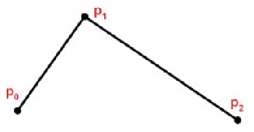

## Chapter 11.1  Quadratic Bézier curves 

A quadratic Bézier curve is defined by a set of parametric equations that specify a particular curved shape
using three control points, each of which is a point in 2D space.


### Example


set of control points:

$\textcolor{red}{[P_0, P_1, P_2]}$


> Control points for a Bézier curve. 

By introducing a parameter `t`, we can build a system of parametric equations that define a curve.

The `t` represents a fraction of the distance along the line segment connecting one control point to the next control point.


> Points at parametric position $t = 0.75$. 

Values for `t` are within the range $[0..1]$ for points along the segment. 

Image above shows one such value, $t = 0.75$, 
applied to the lines connecting $p_0 \to p_1$ and $p_1 \to p_2$ respectively. 

Doing this defines two new points $p_{01}$ (t) and $p_{12}$ (t) along the two original lines. 

We repeat this process for the line segment connecting the two new points $p_{01} (t)$ and $p_{12} (t)$, 
producing point $\textcolor{red}{P(t)}$ where $t = 0.75$ along the line $p_{01} (t) \to p_{12} (t)$. 

$\textcolor{red}{P(t)}$ is one of the points on the resulting curve, and for this reason it is denoted with a capital $\textcolor{red}{P}$.


> Building a quadratic Bézier curve. 

Collecting many points $\textcolor{red}{P(t)}$ for various values of `t` generates a curve, as shown above. 

The more parameter values for `t` that are sampled, the more points $\textcolor{red}{P(t)}$ are generated, and the smoother the
resulting curve. 

<br>

The analytic definition for a quadratic Bézier curve can now be derived. 

First, we note that an arbitrary point `p` on the line segment $p_a \to p_b$ connecting two points $p_a$ and $p_b$ can be represented in terms of the parameter `t` as follows: 

$\textcolor{red}{P_{ab}(t)} = tp_b + (1-t) p_a$

Using this, we find the points $p_{01}$ and $p_{12}$ (points on $p_0 \to p_1$ and $p_1 \to p_2$ respectively) as follows: 

$\textcolor{red}{P_{01}(t)} = tp_1 + (1-t) p_0$ \
$\textcolor{red}{P_{12}(t)} = tp_2 + (1-t) p_1$

Similarly, a point on the connecting line segment between these points would be: 

$\textcolor{red}{P(t)} = tp_{12}(t) + (1-t) p_{01}(t)$

Substituting the definitions of $p_{12}$ and $p_{01}$ gives: 

$\textcolor{red}{P(t)} = t[tp_2+ (1-t)p_1] + (1-t)[tp_1 + (1-t)p_0]$

Factoring and combining terms then gives:

$\textcolor{red}{P(t)} = (1-t)^2 p+0 + (-2t^2 +2t)p_1 + t^2p_2$

or,

$\textcolor{red}{P(t)} = \sum^2_{i=0}p_i{B_i(t)}$

where:

$B_0 = (1-t)^2$ \
$B_1 = -2t^2+2t$ \
$B_2 = t^2$

Thus, we find any point on the curve by a weighted sum of the control points.

The weighting function `B` is often called a "blending function".

<br>

## Chapter 11.2  Cubic Bézier curves 

Extend our model to __four__ control points.

Cubic Bézier curves are capable of defining a much richer set of shapes than are quadratic curves, 
which are limited to concave shapes. 


> Building a cubic Bézier curve. 

As for the quadratic case, we can derive an analytic definition for cubic Bézier curves: 

$\textcolor{red}{P}_{01}(t) = tp_1 + (1-t)p_0$

$\textcolor{red}{P}_{12}(t) = tp_2 + (1-t)p_1$

$\textcolor{red}{P}_{23}(t) = tp_3 + (1-t)p_2$


```math
\textcolor{red}{P}_{01 \to 12} (t) = tp_{12}(t) + (1-t) p_{01}
```

```math
\textcolor{red}{P}_{12 \to 23} (t) = tp_{23}(t) + (1-t) p_{12}
```

<br>

A point on the curve would then be: 

$\textcolor{red}{P}(t) = tp_{12 \to 23}(t) + (1-t)p_{01 \to 12}$ 

Substituting the definitions of $p_{12 \to 23}$ and $p_{01 \to 12}$ and collecting terms yields:

$\textcolor{red}{P}(t) = \sum_{i=0}^3 p_i B_i(t)$

where:

$B_0(t) = (1-t)^3$ \
$B_1(t) = 3t^3 - 6t^2 + 3t$ \
$B_2(t) = -3t^3 + 3t^2$ \
$B_3(t) = t^3$

<br>

```js

function crlPtReduceDeCasteljau(points, t) {
    let retArr = [ points.slice () ];
	while (points.length > 1) {
        let midpoints = [];
		for (let i = 0; i+1 < points.length; ++i) {
			let ax = points[i][0];
			let ay = points[i][1];
			let bx = points[i+1][0];
			let by = points[i+1][1];
            // a * (1-t) + b * t = a + (b - a) * t
			midpoints.push([
				ax + (bx - ax) * t,
				ay + (by - ay) * t,
			]);
		}
        retArr.push (midpoints)
		points = midpoints;
	}
	return retArr;
}
```
> Casteljau’s algorithm

<br>

```cpp

drawBezierCurve (controlPointVector C){
    currentPoint = C[0];
    t = 0.0;
    while(t <= 1.0) {
        nextPoint = (0,0);
        for(i=0;i<=3;i++){
            nextPoint = nextPoint + (blending(i,t) * C[i]);
        }
        drawLine(currentPoint, nextPoint);
        currentPoint = nextPoint;
        t = t + increment;
    }
}
```
> Iterative algorithm for rendering Bézier curves.

<br>

$D_1 = |p_0 - p_1| + |p_1 - p_2| + |p_2 - p_3|$ \
$D_2 = |p_0 - p_3|$

Then, if $D_1 - D_2$ is less than a sufficiently small tolerance, there is no point in further subdivision.


> Subdividing a cubic Bézier curve. 

<br>

An interesting property of the de Casteljau algorithm is that it is possible to 
generate all of the points on thecurve without actually using the previously described blending functions.

<br>

## 11.3 Quadratic Bézier surfaces 

Whereas Bézier curves define curved lines (in 2D or 3D space), 
Bézier surfaces define curved surfaces in 3D space.

Extending the concepts we saw in curves to surfaces requires extending our system 
of parametric equations from one parameter to two parameters.

For Bézier __curves__, we called that parameter `t`. \
For Bézier __surfaces__, we will refer to the parameters as `u` and `v`.

Whereas our curves were composed of points `P(t)`, \
our surfaces will comprise points `P(u,v)` , as shown below:


> Parametric surface.

For quadratic Bézier surfaces, there are three control points on each axis `u` and `v`,
for a total of __nine__ control points.

Below, an example of a set of nine control points (typically called a
$\mathbf{\textcolor{blue}{control}}$ 
$\mathbf{\textcolor{blue}{point}}$ 
$\mathbf{\textcolor{blue}{"mesh"}}$,
and the associated corresponding curved 
$\mathbf{\textcolor{red}{surface}}$.


> Quadratic Bézier control mesh and corresponding surface. 

<br>

The nine control points in the mesh are labeled $p_{ij}$, 
where `i` and `j` represent the indices in the `u` and `v` directions respectively.

Each set of three adjacent control points, such as ($p_{00}, p_{01}, p_{02}$), defines a Bézier curve.

Points $P(u,v)$ on the surface are then defined as a sum of two blending functions, one in the `u`
direction and one in the `v` direction.

The form of the two blending functions for building Bézier surfaces then
follows from the methodology given previously for Bézier curves:

$B_0(u) = (1-u)^2$ \
$B_1(u) = -2u^2 + 2u$ \
$B_2(u) = u^2$ 

$B_0(v) = (1-v)^2$ \
$B_1(v) = -2v^2 + 2v$ \
$B_2(v) = v^3$

The points $P(u,v)$ comprising the Bézier surface are then generated by summing the product 
of each control point $p_{ij}$ and the $i^{th}$ and $j^th$ blending functions evaluated at parametric values `u` and `v` respectively:

$P(u,v) = \sum_{i=0}^2 \sum_{j=0}^2 p_{ij} * B_i(u) * B_j(v)$

The set of generated points that comprise a Bézier surface is sometimes called a __patch__.

<br>

## 11.4 Cubic Bézier surfaces 

Moving from quadratic to cubic surfaces requires utilizing a larger mesh - `4x4` rather than `3x3`.

Below an example of a \
$\mathbf{\textcolor{blue}{16}}$ 
$\mathbf{\textcolor{blue}{control}}$ 
$\mathbf{\textcolor{blue}{point}}$ 
$\mathbf{\textcolor{blue}{mesh}}$ \
and the \
$\mathbf{\textcolor{red}{corresponding}}$
$\mathbf{\textcolor{red}{curved}}$
$\mathbf{\textcolor{red}{surface}}$


> Cubic Bézier control mesh and corresponding surface. 

<br>

As before, we can derive the formula for points $P(u,v)$ on the surface by 
combining the associated blending functions for cubic Bézier curves: 

$P(u,v) = \sum_{i=0}^3 \sum_{j=0}^3 p_{ij} * B_i(u) * B_{j}(v)$

where:

|              u             |             v              |
|----------------------------|----------------------------|
| $B_0(u) = (1-u)^3$         |$B_0(v) = (1-v)^3$          |
| $B_1(u) = 3u^3 -6u^2 + 3u$ |$B_1(v) = 3v^3 -6v^2 + 3v$  |
| $B_2(u) = -3u^3 + 3u^3$    |$B_2(v) = -3v^3 + 3v^3$     |
| $B_3(u) = u^3$             |$B_3(v) = v^3$              |


Rendering Bézier surfaces can also be done with subdivision:

<br>


> subdivision for Bézier surfaces. 

<br>

When rendering Bézier __curves__, we stopped subdividing when the curve was "straight enough". 

For Bézier __surfaces__, we stop recursing when the surface is "flat enough". 

One way of doing this is to ensure that all of the generated points in a 
sub-quadrant control mesh are within some small allowable distance from a plane 
defined by __three__ of the __four__ corner points of that mesh. 

The distance d between a point $(x,y,z)$ and a plane $(A,B,C,D)$ is: 


```math
d = abs\begin{pmatrix} \frac{Ax+By+Cz+D}{\sqrt{A^2+B^2+C^2}} \end{pmatrix}
```

If `d` is less than some sufficiently small tolerance, 
then we stop subdividing, 
and simply use the four corner control points of the sub-quadrant mesh to draw two triangles.

The _tessellation_ stage of the OpenGL pipeline offers an attractive alternative approach for rendering Béziersurfaces based on the iterative algorithm.